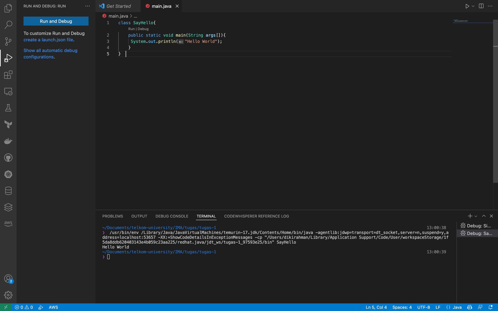

# IMA-java-algorithm

- Nama: Diki
- Kelas: RPLA 46 02

## Code
[Code](https://github.com/mahasiswa-biasa/IMA-java-algorithm/blob/main/main.java)

```
class SayHello{  
    public static void main(String args[]){  
     System.out.println("Hello World");  
    }  
}  
```

## Output
[Image](https://raw.githubusercontent.com/mahasiswa-biasa/IMA-java-algorithm/main/assets/Output.png)




## Ringkasan

[Google Docs](https://docs.google.com/document/d/1ixefjNN-vYFPib_qmprYufnycRE8gJTIq8LMvPI0PPA/edit#)

## Algoritma

Algoritma adalah kumpulan instruksi untuk menyelesaikan suatu masalah secara langkah demi langkah. Kesalahan Pembuatan code saat pemula adalah angsung membuat kode tanpa memikirkan algoritma.

## Java

Java diciptakan oleh James Gosling, developer
dari Sun Microsystems pada tahun 1991 dan diakuisisi oleh oracle pada tahun 2010

### Class

- Cetak biru dari sebuah obyek.
- Kumpulan dari obyek yang memiliki atribut yang sama.
- Kelas didefinisikan oleh programmer secara statik.
- Runtime: kelas / obyek.
    - Kelas Memiliki:
    - Atribut : data, konstanta, properti / variabel
    - Method : service, prosedur, fungsi

### Object

 - Pembentukan Obyek dari sebuah kelas dinamakan instantiasi.
 - Obyek dibuat, dimanipulasi dan dihancurkan pada saat runtime.
 - Obyek disebut juga instance
 - Karakteristik Obyek
    - State / status / atribut
    - Behaviour / method
    - Identitas

